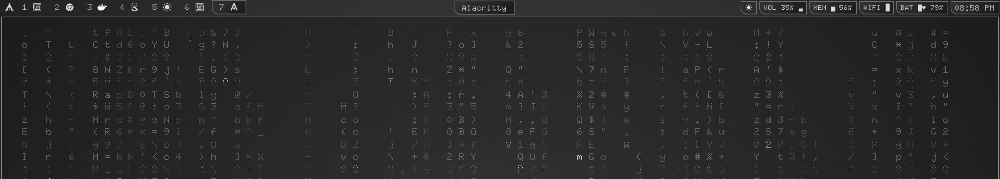
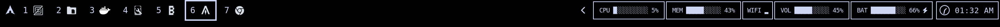

# Waybar with ASCII Art Modules

Minimalist Waybar configuration with ASCII art system monitoring.



## Overview

- ASCII art system monitoring (CPU, Memory, Battery, Volume)
- Custom analog clock display (shoutout to [fshaxe](https://github.com/fshaxe) for the analog clock glyph)
- Workspace app icon integration with YAMIS (Yet Another Monochrome Icon Set) icons


## Configuration

1. Copy configuration files to `~/.config/waybar/`:

   ```bash
   cp config.jsonc style.css ~/.config/waybar/
   cp -r scripts/ ~/.config/waybar/
   ```

2. Make scripts executable:

   ```bash
   chmod +x ~/.config/waybar/scripts/*.sh
   ```

3. Install YAMIS icon theme (for workspace icons):

   Download the theme from [KDE Store YAMIS](https://store.kde.org/p/2303161)

   ```bash
   # Extract the tar.gz file
   tar -xzf yet-another-monochrome-icon-set-*.tar.gz
   
   # Go into the extracted folder and copy YAMIS to /usr/share/icons
   cd yet-another-monochrome-icon-set
   sudo cp -r YAMIS /usr/share/icons/
   ```

   To change the icon theme, edit `config.jsonc`:

   ```jsonc
   "hyprland/workspaces": {
     "workspace-taskbar": {
       "icon-theme": "YAMIS",  // Change to your preferred icon theme name
       // ...
     },
     // ...
   }
   ```

   > You can install your preferred icon theme and update the name accordingly.

4. Install [SimpleAnalogClockFont](https://github.com/fshaxe/SimpleAnalogClockFont) (for analog clock glyph display):

   ```bash
   # Regular font
   curl -L https://github.com/fshaxe/SimpleAnalogClockFont/raw/main/SimpleAnalogClockFont.ttf -o ~/.local/share/fonts/SimpleAnalogClockFont.ttf
   
   # Bold font
   curl -L https://github.com/fshaxe/SimpleAnalogClockFont/raw/main/SimpleAnalogClockFont-Bold.ttf -o ~/.local/share/fonts/SimpleAnalogClockFont-Bold.ttf
   
   # Reload font cache
   fc-cache -f -v
   ```

   > Make sure the font name is specified in the custom clock module in `style.css`:

   ```css
   #custom-analog-clock {
     font-family: "SimpleAnalogClockFont"; /* or SimpleAnalogClockFont-Bold */
     /* ... */
   }
   ```

5. Restart your waybar:

   - For Omarchy users: `Super + Shift + Space`
   - Or run: `pkill waybar && nohup waybar &`

> Preview
> 
## Icon Theme

The configuration uses YAMIS (Yet Another Monochrome Icon Set) for workspace icons. See installation step 3 above for setup instructions.

## Analog Clock

The analog clock uses glyphs from SimpleAnalogClockFont. The font displays a different clock face for each minute of the day (720 unique glyphs).


## Preview


> [!NOTE] 
> **For Omarchy users**: This configuration uses `omarchy-menu-tofi` in the config (tofi variant instead of walker). If you're using omarchy, ensure you have removed the `-walker` suffix commands.
