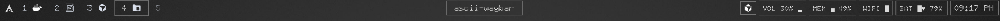
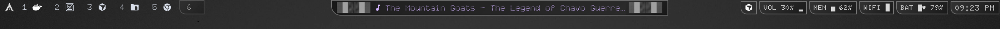
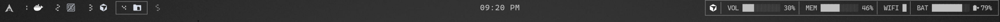
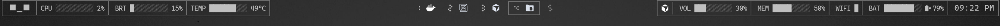
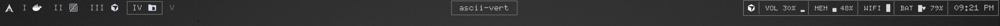
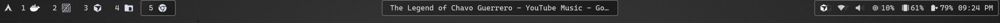

# Retro ASCII Art Waybar

A collection of retro ASCII art themes for Waybar, featuring block character aesthetics and system monitoring modules. Includes workspace app icon integration using YAMIS (Yet Another Monochrome Icon Set) icons, and uses the Doto font for that ASCII look.

## Themes

### [ASCII Air](ascii-air/)

## 

### [ASCII Arc](ascii-arc/)

## 

### [ASCII Cava](ascii-cava/)



> **Note**: This theme requires `waybar-cava` instead of the normal waybar package for audio visualization. Also includes [visualizer.md](ascii-cava/visualizer.md) with various ASCII animation patterns you can use.

---

### [ASCII Grid](ascii-grid/)

## 

### [ASCII Grid V2](ascii-grid-v2/)

## 

### [ASCII Horizontal](ascii-horiz/)

## 

### [ASCII Stats](ascii-stats/)

## 

### [ASCII Vertical](ascii-vert/)

## 

### [Extra](extra/)

## 

## Quick Start

1. Run: This will copy all the waybar styles in your `~/.config/waybar/themes`.

   ```bash
   git clone https://github.com/nirabyte/ascii-waybar.git /tmp/ascii-waybar && mkdir -p ~/.config/waybar/themes && cp -rf /tmp/ascii-waybar/* ~/.config/waybar/themes/ && rm -rf /tmp/ascii-waybar && omarchy-restart-waybar

   ```

   > **Theme Switching**: This collection works seamlessly with [wayflipper](https://github.com/OldJobobo/wayflipper), a Waybar theme switcher for easy theme switching.

2. (Optional) Download the [Doto](https://fonts.google.com/specimen/Doto) or directly get it from the repo and place in your `~/.local/share/fonts`.

   Or Run:

   ```bash
   mkdir -p ~/.local/share/fonts && \
   curl -L -o ~/.local/share/fonts/Doto.ttf \
   https://raw.githubusercontent.com/nirabyte/ascii-waybar/main/fonts/Doto.ttf && \

   # Refresh font cache
   fc-cache -fv
   ```

   > **Font Compatibility**: While ASCII progress bars use fonts like CaskaydiaMono Nerd Font for block characters, the Doto font provides the distinctive retro aesthetic. Some ASCII dots may appear slightly different with Doto, but this is normal for the intended retro look.

3. (Optional) Install YAMIS icon theme (for monochrome workspace icons):

   Download the theme from [KDE Store YAMIS](https://store.kde.org/p/2303161)

   ```bash
   # Extract the tar.gz file
   tar -xzf yet-another-monochrome-icon-set-*.tar.gz

   # Go into the extracted folder and copy YAMIS to ~/.local/share/icons
   cd yet-another-monochrome-icon-set
   sudo cp -r YAMIS ~/.local/share/icons
   ```

   > To change the icon theme, edit `config.jsonc`:

   ```jsonc
   "hyprland/workspaces": {
     "workspace-taskbar": {
       "icon-theme": "YAMIS",  // Change to your preferred icon theme name
       // ...
     },
     // ...
   }
   ```

   > You can install your preferred icon theme and update the name accordingly.

4. Restart your waybar:

- For Omarchy users run:

  ```bash
  omarchy-restart-waybar
  # Or toggle Super+Shift+Space
  ```

- Or run:

  ```bash
  pkill waybar && waybar &
  ```

## ASCII Visualization

All system monitoring modules use block character format-icons for a retro ASCII aesthetic:

```jsonc
// Horizontal progress bar
 "format-icons":
  [
  "░░░░░░░░░░",
  "█░░░░░░░░░",
  "██░░░░░░░░",
  "███░░░░░░░",
  "████░░░░░░",
  "█████░░░░░",
  "██████░░░░",
  "███████░░░",
  "████████░░",
  "█████████░",
  "██████████",

  ]
 // Vertical progress bar
  "format-icons": [
  "░", "▁", "▂", "▃", "▄", "▅", "▆", "▇", "█"
  ]
```

> [!NOTE]
> **For Omarchy users**: This configuration uses `omarchy-menu-tofi` in the config (uses tofi instead of walker that comes with omarchy). If you're using omarchy, ensure you have removed the `-tofi` suffix commands.
